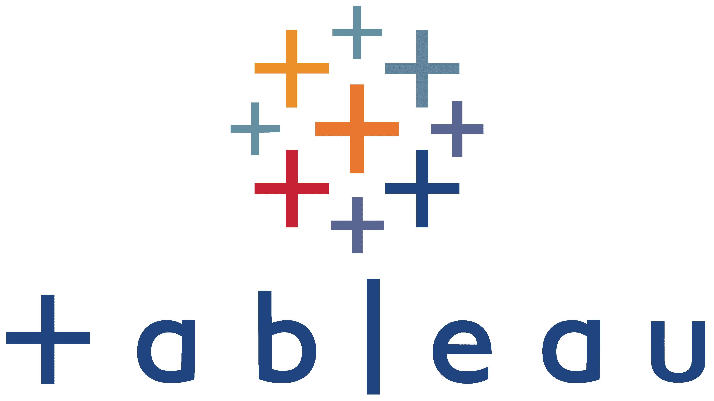

<h1 align="left">Hi, I'm Edd</h2>

Football Data Scientist with [Leicester City Football Club](https://github.com/lcfc-analytics) ⚽📊.

Expertise in:
- Football Analytics
- Data Science
- Python
- R
- SQL
- Tableau

 
 
 

<!-- ABOUT ME-->
<h2 align="left" id="about-me"> 👋 About Me</h2>

I have been working in business and data analysis for both first team football and commercial industries for six years where I currently work as the First Team Lead Data Scientist @ [Leicester City Football Club](https://github.com/lcfc-analytics). Previously <a href="https://analyticsfc.co.uk/" target="_blank">Analytics FC</a> and <a href="https://www.lego.com/" target="_blank">the LEGO Group</a>. I enjoy exploring and working in the fields of data science, machine learning, statistics, data engineering, data visualisation, and football analytics, for which this GitHub profile includes much of my publicly available work around these topics.

Please see my <a href="https://github.com/eddwebster/football_analytics" target="_blank">`football_analytics`</a> repository for a collection of football analytics projects, data, and analysis that I have created, with links to publicly available resources in the football analytics community. 

<!-- CODE-->
<h2 align="left" id="code"> 📚 Code</h2>

Although a little out of date now (with code I would dearly like to refactor), the code in my <a href="https://github.com/eddwebster/football_analytics" target="_blank">`football_analytics`</a> GitHub repository can be found in the [notebooks](https://github.com/eddwebster/football_analytics/tree/master/notebooks) subfolder, of which the workflow is divided into the following:
1.    [Webscraping](https://github.com/eddwebster/football_analytics/tree/master/notebooks/1_data_scraping);
2.    [Data Parsing](https://github.com/eddwebster/football_analytics/tree/master/notebooks/2_data_parsing);
3.    [Data Engineering](https://github.com/eddwebster/football_analytics/tree/master/notebooks/3_data_engineering);
4.    [Data Unification](https://github.com/eddwebster/football_analytics/tree/master/notebooks/4_data_unification); and
5.    [Data Analysis](https://github.com/eddwebster/football_analytics/tree/master/notebooks/5_data_analysis_and_projects) - projects include working with [Tracking data](https://github.com/eddwebster/football_analytics/tree/master/notebooks/5_data_analysis_and_projects/tracking_data), constructing [VAEP models](https://github.com/eddwebster/football_analytics/tree/master/notebooks/5_data_analysis_and_projects/vaep) (as introduced by SciSports), building [xG models](https://github.com/eddwebster/football_analytics/tree/master/notebooks/5_data_analysis_and_projects/xg_modeling) using [Logistic Regression](https://nbviewer.jupyter.org/github/eddwebster/football_analytics/blob/master/notebooks/5_data_analysis_and_projects/xg_modeling/shots_dataset/chance_quality_modelling/1%29%20Logistic%20Regression%20Expected%20Goals%20Model.ipynb), Random Forests and Gradient Boosted Decision Tree algorithms such as [XGBoost](https://nbviewer.jupyter.org/github/eddwebster/football_analytics/blob/master/notebooks/5_data_analysis_and_projects/xg_modeling/shots_dataset/chance_quality_modelling/2%29%20XGBoost%20Expected%20Goals%20Model.ipynb) and [CatBoost](https://nbviewer.jupyter.org/github/eddwebster/football_analytics/blob/master/notebooks/5_data_analysis_and_projects/xg_modeling/shots_dataset/chance_quality_modelling/3%29%20CatBoost%20Expected%20Goals%20Model.ipynb), and analysing [player similarity](https://github.com/eddwebster/football_analytics/tree/master/notebooks/5_data_analysis_and_projects/player_similarity_and_clustering) using PCA and K-Means clustering).

<!-- DATA VISUALISATION AND TABLEAU-->
<h2 align="left" id="data-visualisation-and-tableau"> 📚 Data Visualisation and Tableau </h2>

For Tableau dashboards produced using the data engineered in the notebooks in this repository, please see my Tableau Public profile: [public.tableau.com/profile/edd.webster](https://public.tableau.com/profile/edd.webster).

Example Tableau dashboards:
*    [2018 FIFA Men's World Cup](https://public.tableau.com/app/profile/edd.webster/viz/EddWebster-WorldCup2018AnalysisandDashboard/WC2018PlayerDashboard);
*    [FA WSL](https://public.tableau.com/app/profile/edd.webster/viz/EddWebsterFAWSLAnalysisandDashboard/WSLxGAnalysisDashboard);
*    [‘Big 5’ European leagues](https://public.tableau.com/app/profile/edd.webster/viz/EddWebsterBig5EuropeanLeagueAnalysisandDashboards/Big5WaffleChart);
*    [EFL](https://public.tableau.com/app/profile/edd.webster/viz/EddWebsterEFLAnalysisandDashboards/EFLFullBackRadarDashboard); and
*    [StrataBet Chance creation](https://public.tableau.com/app/profile/edd.webster/viz/EddWebsterStrataBetChanceAnalysisandDashboards/StrataBetChanceShotMapDashboard).

<!-- Tech Stack -->
<h2 align="left" id="tech-stack"> 👋 Tech Stack</h2>

I am comfortable working with the following languages and software:

Python: 

<table align="center">
    <tr>
        <td align="center" width="140" height="112.43">
            
              Python
        </td>
        <td align="center" width="140" height="112.43">
            
              Jupyter Notebooks
        </td>
        <td align="center" width="140" height="112.43">
            
              pandas
        </td>
        <td align="center" width="140" height="112.43">
            
              NumPy
        </td>
        <td align="center" width="140" height="112.43">
            
              Scikit Learn
        </td>
        <td align="center" width="140" height="112.43">
            
              matplotlib
        </td>
        <td align="center" width="140" height="112.43">
            
              PySpark
        </td>
    </tr>
</table>

Other Data Science languages and tools: 

<table align="center">
    <tr>
        <td align="center" width="140" height="112.43">
            
              R
        </td>
        <td align="center" width="140" height="112.43">
            
              R Studio
        </td>
        <td align="center" width="140" height="112.43">
            
              Tidyverse
        </td>
        <td align="center" width="140" height="112.43">
            
              Tableau
        </td>
        <td align="center" width="140" height="112.43">
            
              Power BI
        </td>
        <td align="center" width="140" height="112.43">
            
              Databricks
        </td>
        <td align="center" width="140" height="112.43">
            
              Airflow
        </td>
        <td align="center" width="140" height="112.43">
            
              AWS
        </td>
        <td align="center" width="140" height="112.43">
            
              Docker
        </td>
    </tr>
</table>

<!-- GITHUB STATS-->
<h2 align="left" id="github-stats"> 📈 GitHub Stats</h2>

<!-- FOOTBALL ANALYTICS GITHUB STATS-->
<h2 align="left" id="football-analytics-github-stats"> ⭐ Football Analytics GitHub Stars History</h2>

Star tracker for the <a href="https://github.com/eddwebster/football_analytics" target="_blank">`football_analytics`</a> repository of open-source football analysis projects and resources.

<!-- CONTACT-->
<h2 align="left" id="contact"> 📫 Contact</h2>

For more information, I am available through all the following channels:

